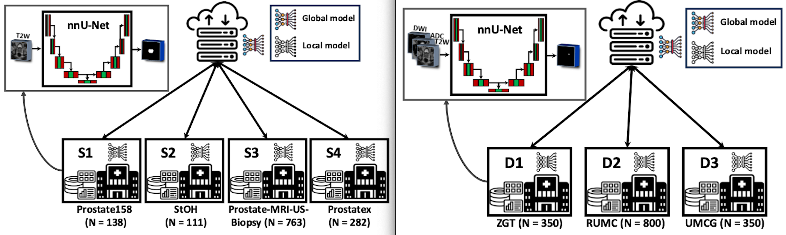
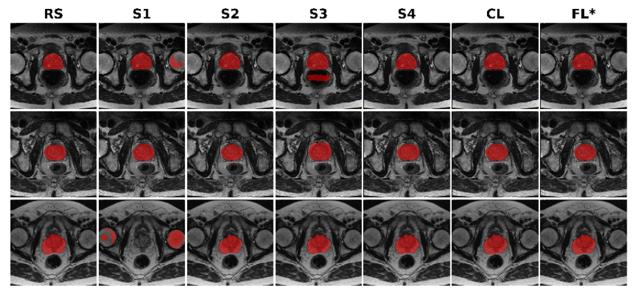
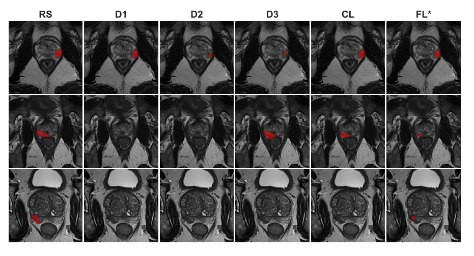
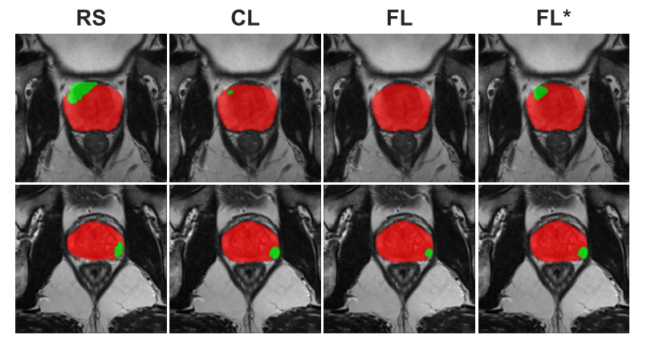

# Federate Learning for  Prostate Segmentation and Lesion Detection

**Optimizing Federated Learning Configurations for MRI Prostate Segmentation and Cancer Detection:**  

In this study, we proposed a federated learning (FL) approach for prostate segmentation on T2-weighted MRI data involving four clients and a total of 1,294 patient cases, as well as for detecting clinically significant prostate cancer (csPCa) on biparametric MRI data (T2W, HBV, and ADC) using three clients and 1,500 patient cases in total (data from [PI-CAI (Prostate Imaging: Cancer AI) grand challenge](https://pi-cai.grand-challenge.org/)). A schematic of the implemented scenarios, including details on data distribution, is presented in the following, prostate segmentation on the left and csPCa detection on the right.

<p align="center">
  
</p>

### Abstract:

**Purpose:** To investigate and optimize a federated learning (FL) framework across multiple clients for biparametric MRI prostate segmentation and clinically significant prostate cancer (csPCa) detection.

**Materials and Methods:** A retrospective study was conducted using Flower FL to train a nnU- Net-based architecture for MRI prostate segmentation and lesion detection with data from January 2010 to August 2021. This included training and optimizing local epochs, federated rounds, and aggregation strategies for FL-based prostate segmentation on T2-weighted MRIs (four clients, 1294 patients) and csPCa detection using biparametric MRIs (three clients, 1440 patients). Performance was evaluated on independent test sets using the Dice score for segmentation and receiver operating characteristic and precision-recall curve analyses for detection, with p-values for performance differences from permutation testing.

**Results:** The FL configurations were independently optimized for both tasks, showing improved performance at 1 epoch 300 rounds using FedMedian for prostate segmentation and 5 epochs 200 rounds using FedAdagrad, for csPCa detection. Although the optimized FL model significantly improved performance and generalizability on independent test set compared with the average of local models, segmentation Dice score from 0.73±0.06 to 0.88±0.03 (P ≤ 0.01) and the lesion detection score, (AUC+AP)/2, from 0.63±0.07 to 0.74±0.06 (P ≤ 0.01), there was no proof of improved segmentation performance compared with the FL-baseline model.

**Conclusion:** FL enhanced the performance and generalizability of MRI prostate segmentation and csPCa detection compared with local models and optimizing its configuration further improved the lesion detection score, from 0.72±0.06 to 0.74±0.06 (P≤0.01).

#### Segmentation Performance:
<p align="center">
  
</p>

#### Detection Performance:
<p align="center">
  
</p>

#### Segmentation and Detection Performance:
<p align="center">
  
</p>

## Installation:
Clone the entire repository to your local system, and then install the environment using the `.yml` file: 
```bash
git clone https://github.com/AshknMrd/moradi2025rai.git
conda env create -f environment.yml
```
Next, install the pipelines developed by the PI-CAI Grand Challenge organizers for data conversion (DICOM to MHA, MHA to nnU-Net Raw Data). Details for data conversion and evaluation for the Detection task, following the PI-CAI Grand Challenge guidelines, are provided in [`picai_prep`](https://github.com/DIAGNijmegen/picai_prep) and [`picai_eval`](https://github.com/DIAGNijmegen/picai_eval), respectively. For the segmentation task, the Dice score, relative volume difference, and HD95 distance are used as evaluation metrics. The modified version of the nnUNet codebase ([version 1.7.0](https://github.com/MIC-DKFZ/nnUNet/tree/nnunetv1)) and Flower must be also installed:

```bash
cd nnUNet  
pip install -e .
pip install flwr==1.3.0
```

## Usage:

### csPCa Detection Task:
Replace the aggregation strategy to try out diffrent aggregations:

```Python
strategy = FedAdagrad(
  fraction_fit=1.0,
  min_fit_clients=args.min_fit_clients,
  min_available_clients=args.min_aval_clients,
  initial_parameters=get_parameters(),
  eta=1e-1,
  eta_l=1e-1,
  tau=1e-9)

strategy = FedAdam(
  fraction_fit=1.0,
  min_fit_clients=args.min_fit_clients,
  min_available_clients=args.min_aval_clients,
  initial_parameters=get_parameters(),
  eta=1e-1,
  eta_l=1e-1,
  beta_1=0.9,
  beta_2=0.99,
  tau=1e-9)

strategy = FedMedian(
  fraction_fit=1.0,
  min_fit_clients=args.min_fit_clients,
  min_available_clients=args.min_aval_clients,
  initial_parameters=get_parameters())

strategy = FedTrimmedAvg(
  fraction_fit=1.0,
  min_fit_clients=args.min_fit_clients,
  min_available_clients=args.min_aval_clients,
  initial_parameters=get_parameters(),
  beta=0.2)

strategy = FedYogi(
  fraction_fit=1.0,
  min_fit_clients=args.min_fit_clients,
  min_available_clients=args.min_aval_clients,
  initial_parameters=get_parameters(),
  eta=1e-2,
  eta_l=0.0316,
  beta_1=0.9,
  beta_2=0.99,
  tau=1e-3)
```

## 📖 Citation
The method was developed at the [CIMORe](https://www.ntnu.edu/isb/mr-cancer) - Cancer Imaging and Multi-Omics Research Group at the Norwegian University of Science and Technology (NTNU) in Trondheim, Norway. For detailed information about this method, please read our [SPIE medical imaging conference paper](https://www.spiedigitallibrary.org/conference-proceedings-of-spie/12927/129271Q/Federated-learning-for-prostate-cancer-detection-in-biparametric-MRI/10.1117/12.2688568.full) or the [Radiology Artificial Intelligence manuscript](https://www.to_be_add.com). If you use this work, please cite:

```bibtex
...
```
and
```bibtex
@inproceedings{moradi2024federated,
  title={Federated learning for prostate cancer detection in biparametric MRI: optimization of rounds, epochs, and aggregation strategy},
  author={Moradi, Ashkan and Zerka, Fadila and Bosma, Joeran Sander and Yakar, Derya and Geerdink, Jeroen and Huisman, Henkjan and Bathen, Tone Frost and Elschot, Mattijs},
  booktitle={SPIE Medical Imaging 2024: Computer-Aided Diagnosis},
  volume={12927},
  pages={412--421},
  year={2024}}
``` 


## Acknowledgements
We acknowledge the authors of the publicly available datasets used in this study, whose contributions have enabled valuable research. Additionally, we extend our gratitude to the developers of [Flower](https://flower.ai/), [nnU-Net](https://github.com/MIC-DKFZ/nnUNet), and the [PI-CAI](https://pi-cai.grand-challenge.org/) Grand Challenge for making their important contributions publicly accessible.


Complete details about the implementation and the required software and packages will be made publicly available upon publication of the manuscript (stay tuned...)

